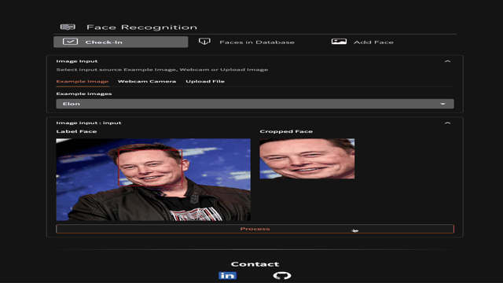

# Streamlit-portfolio

In this portfolio, you will find a showcase of my data science projects and the skills I have acquired
### Build web app for presenting my projects
let's try on this link
[Streamlit Webapp](https://natapollim-streamlit-portfolio-0-profile-ayvdum.streamlit.app)

## Face Blur Image
Goal of this project is learn to use MTCNN algorothm and Streamlit framework

This app used to Blur wanted faces which are detected from Face Detection model.

Have **3** main steps

**Step1:** Upload an image or try with an example image

**Step2:** Processing and select wanted faces

**Step3:** Then hit summit button for blur process and click 'Download' for download
## Face Recognition
**Goal:** design basic features of face recognition system and learn to preprocess image and use deep learning model

This app have **3** features
- Check-In
- Face in Database
- Add Face
        
**Check-In:** Mock situation of already have your own face in the Database and would like to check attendance

**Face in Database:** Show all faces that in Database now

**Add Face:** Add new face in to Database
  
### Example cases
      
**Example1:** you can try an example Elon or Code image which already have different face in Database

**Example2:** you can upload your image in to Add Face page and fill the name then click 'Add face'.
        After you have added new face, you can check by upload a new image with the same person on Check-In page and click 'Process' to see the result

**Example3:** Use your webcam camera to Add Face or Check-In

## Face Tracking & Recognition

Implementing...
